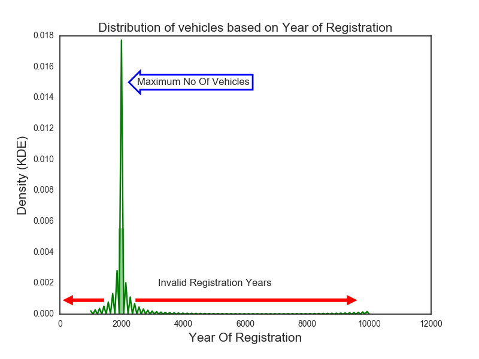
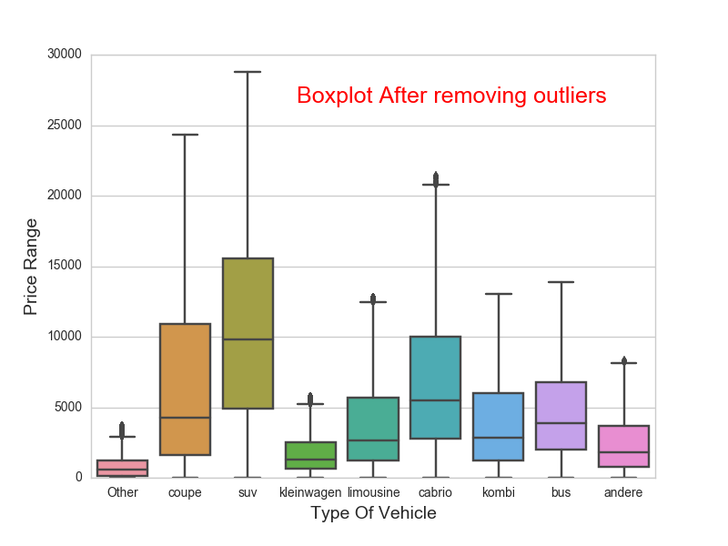
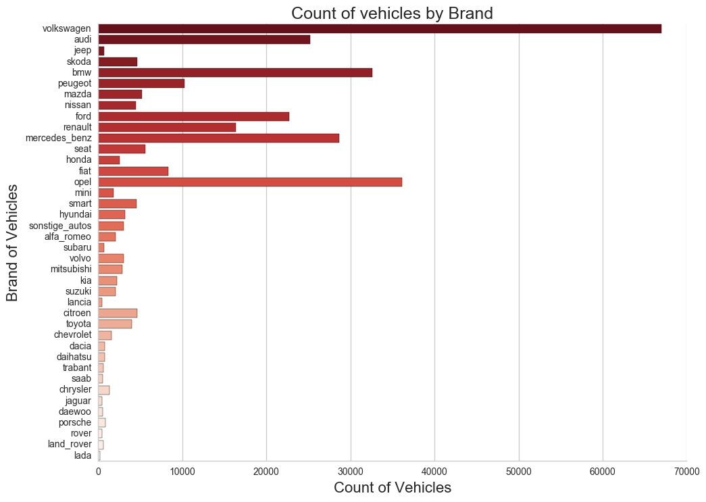
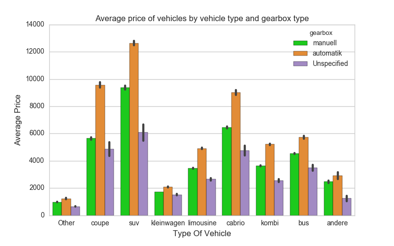
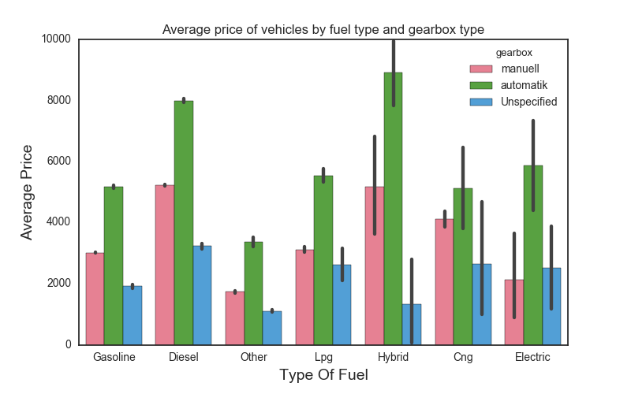
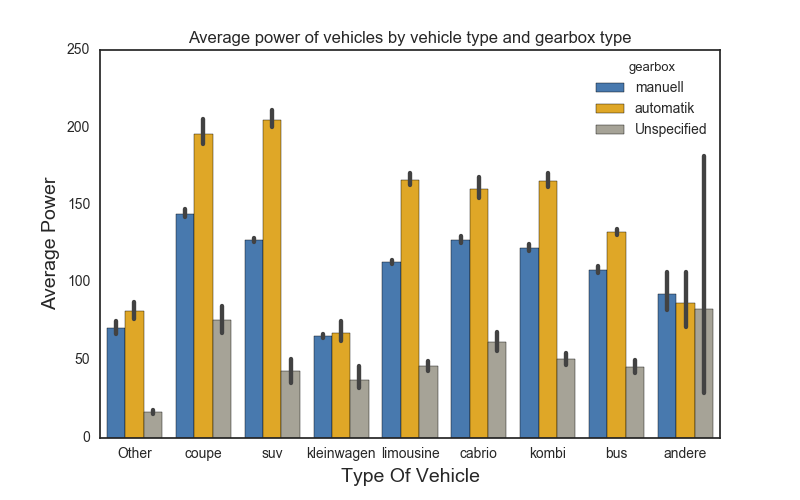
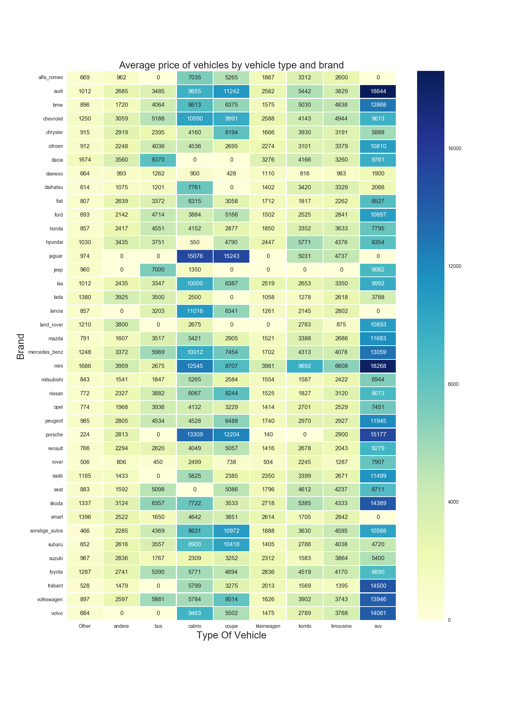
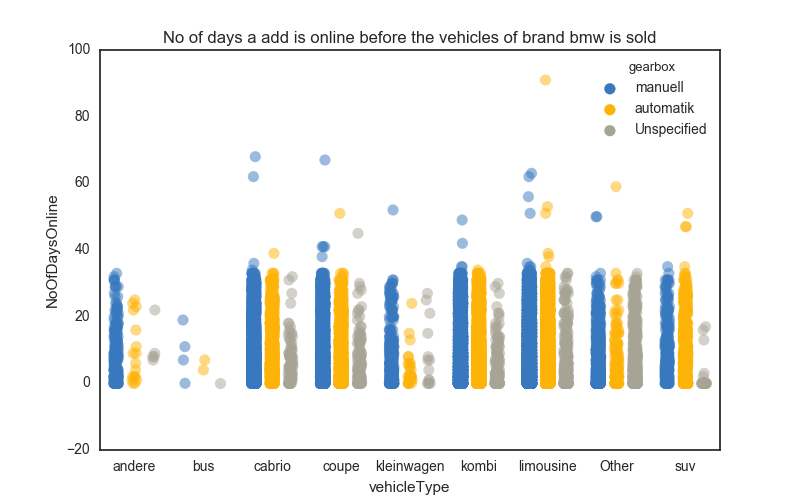

# Data Analysis of Used Car Database &nbsp;&nbsp;[]

Data Analysis, sometimes referred to as **Exploratory Data Analysis (EDA)**, is one of the core components of data science. It is also the part on which data scientists, data engineers, and data analysts spend the majority of their time, making it extremely important in the field of data science. This repository demonstrates some common exploratory data analysis methods and techniques using Python. For the purpose of illustration, the **[Used Car Database](https://www.kaggle.com/orgesleka/used-cars-database)** dataset has been taken from Kaggle since it is an ideal dataset for performing **EDA** and taking a step towards the most amazing and interesting field of data science. Good luck with your _**EDA**_ on the _**Used Car Database**_ dataset.

### DataSet Overview
  + The dataset is taken from **Kaggle** and contains details of **used cars in Germany** that are on sale on **eBay**.
  + The dataset is not clean, and hence a lot of data cleaning is carried out. For example, prices were too high, which are replaced by the median, and outliers are removed accordingly.
  + Also, vehicles whose registration year was **_greater than 2016_ and _less than 1890_** were removed from the dataset as this data is inconsistent and would yield incorrect results.
  + The dataset is cleaned and stored in a **CleanData** folder, which contains the entire cleaned dataset named **[cleaned_autos.csv](CleanData/CleanedDataSet)** and another folder named **[DataForAnalysis](CleanData/DataForAnalysis)** containing file structures containing subsets of the cleaned dataset based on the brand of the vehicles and vehicle types.

  
### Sample Dataset
dateCrawled | name | seller | offerType | price | abtest | vehicleType | yearOfRegistration | gearbox | powerPS | model | kilometer | monthOfRegistration | fuelType | brand | notRepairedDamage | dateCreated | nrOfPictures | postalCode | lastSeen
--- | --- | --- | --- | --- | --- | --- | --- | --- |--- | --- | --- | --- | --- | --- | --- | --- | --- | --- | ---
2016-03-24 11:52:17 | Golf_3_1.6 | privat | Angebot | 480 | test | nan | 1993 | manuell | 0 | golf | 150000 | 0 | benzin | volkswagen | nan | 2016-03-24 00:00:00 | 0 | 70435 | 2016-04-07 03:16:57
2016-03-24 10:58:45 | A5_Sportback_2.7_Tdi | privat | Angebot | 18300 | test | coupe | 2011 | manuell | 190 | nan | 125000 | 5 | diesel | audi | ja | 2016-03-24 00:00:00 | 0 | 66954 | 2016-04-07 01:46:50
2016-03-14 12:52:21 | Jeep_Grand_Cherokee_"Overland" | privat | Angebot | 9800 | test | suv | 2004 | automatik | 163 | grand | 125000 | 8 | diesel | jeep | nan | 2016-03-14 00:00:00 | 0 | 90480 | 2016-04-05 12:47:46
***
### More Info

__*The main folder contains 9 folders.*__

  + Folders from Analysis1 to Analysis5 contain the **iPython Notebook**, **Python scripts**, along with the **plots** for that analysis.
  + A folder for **[shell scripts](ShellScripts)**, which automate the creation of file structures and the splitting of data as mentioned above.
  + The Datapreparation folder contains the **[Datapreparation iPython Script](DataPreparation/DataPreparation.py)** for cleaning the data.
  + The CleanData folder contains the clean dataset and subsets of data as per the **[file structure](CleanData/DataForAnalysis)**.
  + The RawData folder contains the **[raw dataset](RawData)**.

 
***
### Analysis 1 &emsp;&emsp;&emsp;&emsp;&emsp;&emsp;&emsp;&emsp;&emsp;&emsp;&emsp;&emsp;&emsp;&emsp;&emsp;&emsp;&emsp;&emsp;&emsp;&emsp;&emsp;&emsp;[Analysis1.py](Analysis1/Analysis1.py)&emsp;[Analysis1.ipynb](Analysis1/Analysis1.ipynb)&emsp;[Plots](Analysis1/Plots)
+ This analysis gives the distribution of prices of vehicles based on vehicle types.
+ The output before cleaning the data is shown below to highlight the importance of cleaning this dataset.
+ **Histogram** and **KDE** before performing data cleaning.
+ It is clearly visible that the dataset has **many outliers** and **inconsistent data** as the year of registration **cannot be more than 2016 and less than 1890**.

> Boxplot of prices of vehicles based on the type of vehicles after cleaning the dataset. Based on the vehicle type, how the prices vary is depicted from the boxplot. Low, 25th, 50th (Median), 75th percentile, high can be estimated from this boxplot.

***

### Analysis 2 &emsp;&emsp;&emsp;&emsp;&emsp;&emsp;&emsp;&emsp;&emsp;&emsp;&emsp;&emsp;&emsp;&emsp;&emsp;&emsp;&emsp;&emsp;&emsp;&emsp;&emsp;&emsp;[Analysis2.py](Analysis2/Analysis2.py)&emsp;[Analysis2.ipynb](Analysis2/Analysis2.ipynb)&emsp;[Plots](Analysis2/Plots)

+ This analysis gives the number of cars available for sale in the entire dataset based on a particular brand. 

> Barplot of the average price of vehicles for sale based on the type of the vehicle as well as based on the gearbox of the vehicle.

***

### Analysis 3 &emsp;&emsp;&emsp;&emsp;&emsp;&emsp;&emsp;&emsp;&emsp;&emsp;&emsp;&emsp;&emsp;&emsp;&emsp;&emsp;&emsp;&emsp;&emsp;&emsp;&emsp;&emsp;[Analysis3.py](Analysis3/Analysis3.py)&emsp;[Analysis3.ipynb](Analysis3/Analysis3.ipynb)&emsp;[Plots](Analysis3/Plots)

+ This analysis gives the average price of vehicles based on the fuel type of the vehicle and also based on the type of the vehicle.

> Barplot of average power of the vehicle based on the fuel type of the vehicle and also on the type of the vehicle.

***

### Analysis 4 &emsp;&emsp;&emsp;&emsp;&emsp;&emsp;&emsp;&emsp;&emsp;&emsp;&emsp;&emsp;&emsp;&emsp;&emsp;&emsp;&emsp;&emsp;&emsp;&emsp;&emsp;[Analysis4.py](Analysis4/Analysis4.py)&emsp;[Analysis4.ipynb](Analysis4/Analysis4.ipynb)&emsp;[Plots](Analysis4/Plots)

+ This analysis gives you the average price of the brand of vehicles and their types likely to be found in the dataset.

***
### Analysis 5 &emsp;&emsp;&emsp;&emsp;&emsp;&emsp;&emsp;&emsp;&emsp;&emsp;&emsp;&emsp;&emsp;&emsp;&emsp;&emsp;&emsp;&emsp;&emsp;&emsp;&emsp;[Analysis5.py](Analysis5/Analysis5.py)&emsp;[Analysis5.ipynb](Analysis5/Analysis5.ipynb)&emsp;[Plots](Analysis5/Plots)

+ This analysis gives you the distribution of the total number of days a particular vehicle has been online for sale before it was purchased. 
+ This is a **dynamic analysis** and can be applied to **any vehicle** by specifying the brand of choice as an argument to the Python script.
+ To run this file on your terminal, type: __*Analysis5.py 'brand'*__  
+ where **'brand'** is the choice of brand vehicle you would like to see the analysis about from the column **'brand'** in the dataset.

***

### Conclusion
__*Analysis 1*__

+ Many **outliers** with a *registration year greater than 2016 and less than 1890* were removed to make the dataset ready for analysis.
+ Vehicles with a registration year of **1990-2016** are available **most** for sale. The year **2000** has the **highest** number of vehicles with **24313** units.

__*Analysis 2*__

+ Vehicles of types **SUV** and **Cabrio** are the **most expensive**, priced at **greater than $5000**, compared to **Coupe**, **Bus**, etc., which are **moderately expensive** in the range of **$2650 to $5000**, while **Andere** and **Others** are the **least expensive**, priced at **less than $1800** on average.
+ Vehicles of brands **Volkswagen**, **Opel**, and **BMW** are the **most frequently listed for sale**, in decreasing order, with *Volkswagen* being the most common.
+ As a general trend, automatic vehicles are the most expensive compared to manual and other unspecified gearbox types.

__*Analysis 3*__

+ **Hybrid** vehicles have the **highest average prices** compared to other fuel types like Diesel and Gasoline.
+ **SUV** vehicles with automatic gearbox types have the **highest power**, while **Kleinwagen** has the least.

__*Analysis 4*__

+ Vehicles of the **Audi** brand and **SUV** type are the **most expensive** among the available vehicles for sale.
+ Vehicles of the **Porsche** brand and **Kleinwagen** type are the **least expensive** among the available vehicles for sale.

__*Analysis 5*__

+ Based on the selected brand of choice, it can be determined which **types of vehicles** in the **selected brand** tend to **sell quickly online** compared to others.

***

